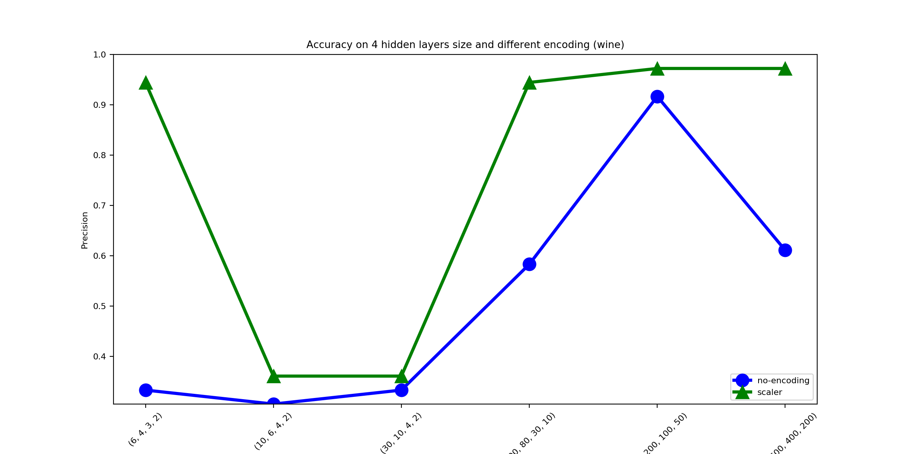

# Homework 02 - Machine learning a.a. 2018/19

## Index
1. [Utilized library](#utilized-library)
1. [Script usage](#script-usage)
1. [Script description](#script-description)
1. [Reports description](#reports-description)
    1. [Short report](#short-report)
    2. [Precision graph](#precision-graph)
    3. [Report, Precision graph and Confusion Matrix for K-Folding](#report-precision-graph-and-confusion-matrix-for-k-folding)
1. [Reports (real)](#reports-real)
    1. [Wine](#wine)
        1. [Short report](#short-report-1)
        2. [Precision graph](#precision-graph-1)
        3. [Report, Precision graph and Confusion matrix for K-Folding](#report-precision-graph-and-confusion-matrix-for-k-folding-1)
        4. [Conclusions](#conclusions)
    2. [Breast Cancer Wisconsin](#breast-cancer-wisconsin)
        1. [Short report](#short-report-2)
        2. [Precision graph](#precision-graph-2)
        3. [Report, Precision graph and Confusion matrix for K-Folding](#report-precision-graph-and-confusion-matrix-for-k-folding-2)
        4. [Conclusions](#conclusions-1)
    3. [Letter Recognition](#letter-recognition)
        1. [Short report](#short-report-3)
        2. [Precision graph](#precision-graph-3)
        3. [Report, Precision graph and Confusion matrix for K-Folding](#report-precision-graph-and-confusion-matrix-for-k-folding-3)
        4. [Conclusions](#conclusions-2)
    4. [Poker Hand](#poker-hand)
        1. [Short report](#short-report-4)
        2. [Precision graph](#precision-graph-4)
        3. [Report, Precision graph and Confusion matrix for K-Folding](#report-precision-graph-and-confusion-matrix-for-k-folding-4)
        4. [Conclusions](#conclusions-3)            

## Utilized library

Le librerie utilizzate sono:

* **pandas**: caricamento e manipolazione del **DataSet**
* **sklearn**: algoritmi, statistiche e suddivisione del **TrainingSet**
* **matplotlib**: grafici


## Script usage

```bash
main.py [wine|breast-cancer|letters|poker][test_size < 1 | k-fold > 1][-v]
```

* **dataset**: [wine|breast-cancer|letters|poker] - select DataSet. Default is *wine*
* **test_size**: [0,1] - TestSet dimension
* **k-fold**: {0, 1, 2, 3, 4, 5...} - K fold iteration
* **-v**: Abilita il verbose durante il Training

> **nota**: Le altre opzioni come gli hidden layers, l'encoding, la matrice di confusione, grafici, etc... sono configurabili nel sorgente

## Script description

I *DataSet* prevedono tutti una classificazione:
* **binaria**: 
    * *2 breast-cancer*: `benign, malignant`
* **multi-class**:
    * *3 wine*: `1, 2, 3`
    * *10 poker*: `0, 1, 2, 3, 4, 5, 6, 7, 8, 9`
    * *26 letters*: `A, B, C, D, E, F, G, H, I, J, K, L, M, N, O, P, Q, R, S, T, U, V, W, X, Y, Z`

I *DataSet* sono stati ripuliti dalle features non *indicative* e sono state eliminate le righe con *'?'*.  
Per ogni *DataSet* sono state utilizzate diverse **architetture MLP**, così da verificare l'andamento della rete neurale
al variare degli **hidden layers** nella dimensione e nel numero dei livelli.

Elenco delle *architetture MLP* utilizzate su tutti *DataSet*, ordinate per numero di livelli:
1. `2, 10, 60, 160, 300, 800, 1600, 3000, 10000`
2. `(4, 2), (8, 4), (18, 8), (40, 18), (100, 40), (300, 100), (1000, 400)`
3. `(4, 3, 2), (10, 6, 4), (30, 10, 4), (100, 80, 30), (300, 200, 100), (800, 600, 400), (1000, 800, 400)`
4. `(6, 4, 3, 2), (10, 6, 4, 2), (30, 10, 4, 2), (100, 80, 30, 10), (300, 200, 100, 50), (800, 600, 400, 200)`

Sono esclusi dall'architettura:
* il **layer di input** di dimensioni sempre uguali al numero delle **features**
* il **layer di output** di cardinalità uguale al numero delle **classi**.

Sono stati anche utilizzati due diversi tipi di **encoding dell'input**:
* **Scaling**: Centra e scala ogni feature indipendentemente
* **One Hot**: Trasforma l'input in **vettore caratteristico** (esercizio **3.e** del midterm)

Infine si è utlizzata la **cross-validation** attraverso il **k-folding**


## Reports description

### Short report

**DataSet Length**: Lunghezza/cardinalità del *DataSet*.  
**Encoded input**: Encoding applicati. Questi sono alternativi, e non cumulativi.

*DataSet* split è nella proporzione *80/20*.

Il report è suddiviso in 3 parti che sono rispettivamente i 3 *input encoding differenti*.

Per ogni encoding viene effettuato il training e testato per tutte le differenti *architetture MLP* (viste sopra).  
Per ognuna di queste viene riportata la:
* **precision**: accuratezza o hitrate
* **epochs**: il numero di epoche necessario per effettuare il training
* **out/func**: indicano il numero di units nell'uscita e la funzione di attivazione utilizzata (ovviamente rimangono inalterate)

> **nota**: il numero delle epoche può essere massimo 1000, e può interrompersi prima, quando **l'errore (loss)**, non migliora
di *0.000100* per 10 epoche consecutive.

Infine viene indicato il tempo totale di esecuzione dell'intero processo (**running time**). 

### Precision graph

Il grafico mette a confronto l'andamento della precisione con i 3 encoder utilizzati:
* *blu*: no encoding
* *verde*: scaling
* *rosso*: one hot (*characteristic vectors*)

Sulle ascisse abbiamo le *architetture MLP* e sulle ordinate la *precisione*.

> **nota**: per una più facile consultazione i grafici vengono suddivisi per numero di hidden layers.

### Report, Precision graph and Confusion Matrix for K-Folding

Dopo aver *'individuato'* il *'miglior'* encoding e architettura MLP con i precedenti grafici e report,
si procede alla *'validazione*' della MLP con il K-Folding ed un report più approfondito.

Per ogni **K**-esima iterazione visualizzeremo:
* **confusion matrix**
* **recall**: `tp / (tp + fn)` - l'abilità del MLP di individuare tutti i positivi
* **f1-score**: `2 * (precision * recall) / (precision + recall)` - la media pesata della precision e del recall 
* **support**: numero di classi nel test

Infine viene riportato il grafico della *precision* per ogni iterazione del *k-fold*.

## Reports (real)

### Wine

#### Short report
```
DataSet Length: 178
Encoded input: Center and scaling
### Running normal test on wine (test size: 0.2)

## no-encoding: [1.423e+01 1.710e+00 2.430e+00 1.560e+01 1.270e+02 2.800e+00 3.060e+00
 2.800e-01 2.290e+00 5.640e+00 1.040e+00 3.920e+00 1.065e+03])
# 2                    => Precision: 0.3333 (epochs:   12 | out:  3 | func:  softmax)
# 10                   => Precision: 0.2778 (epochs:   12 | out:  3 | func:  softmax)
# 60                   => Precision: 0.9167 (epochs:  970 | out:  3 | func:  softmax)
# 160                  => Precision: 0.9167 (epochs:  591 | out:  3 | func:  softmax)
# 300                  => Precision: 0.9167 (epochs:  702 | out:  3 | func:  softmax)
# 800                  => Precision: 0.6944 (epochs:   27 | out:  3 | func:  softmax)
# 1600                 => Precision: 0.5278 (epochs:   22 | out:  3 | func:  softmax)
# 3000                 => Precision: 0.6111 (epochs:   32 | out:  3 | func:  softmax)
# 10000                => Precision: 0.9167 (epochs:  318 | out:  3 | func:  softmax)
# (4, 2)               => Precision: 0.3611 (epochs:  178 | out:  3 | func:  softmax)
# (8, 4)               => Precision: 0.3056 (epochs:   27 | out:  3 | func:  softmax)
# (18, 8)              => Precision: 0.6111 (epochs:  102 | out:  3 | func:  softmax)
# (40, 18)             => Precision: 0.5833 (epochs:   25 | out:  3 | func:  softmax)
# (100, 40)            => Precision: 0.9167 (epochs:  866 | out:  3 | func:  softmax)
# (300, 100)           => Precision: 0.9167 (epochs:  686 | out:  3 | func:  softmax)
# (1000, 400)          => Precision: 0.5556 (epochs:   53 | out:  3 | func:  softmax)
# (4, 3, 2)            => Precision: 0.3056 (epochs:  515 | out:  3 | func:  softmax)
# (10, 6, 4)           => Precision: 0.3333 (epochs:   37 | out:  3 | func:  softmax)
# (30, 10, 4)          => Precision: 0.6111 (epochs: 1000 | out:  3 | func:  softmax)
# (100, 80, 30)        => Precision: 0.6111 (epochs:   34 | out:  3 | func:  softmax)
# (300, 200, 100)      => Precision: 0.5833 (epochs:   21 | out:  3 | func:  softmax)
# (800, 600, 400)      => Precision: 0.5833 (epochs:   27 | out:  3 | func:  softmax)
# (1000, 800, 400)     => Precision: 0.6389 (epochs:   36 | out:  3 | func:  softmax)
# (6, 4, 3, 2)         => Precision: 0.3333 (epochs:   12 | out:  3 | func:  softmax)
# (10, 6, 4, 2)        => Precision: 0.3056 (epochs: 1000 | out:  3 | func:  softmax)
# (30, 10, 4, 2)       => Precision: 0.3333 (epochs:  208 | out:  3 | func:  softmax)
# (100, 80, 30, 10)    => Precision: 0.5833 (epochs:   28 | out:  3 | func:  softmax)
# (300, 200, 100, 50)  => Precision: 0.9167 (epochs:  600 | out:  3 | func:  softmax)
# (800, 600, 400, 200) => Precision: 0.6111 (epochs:   33 | out:  3 | func:  softmax)

## scaler: [ 1.51861254 -0.5622498   0.23205254 -1.16959318  1.91390522  0.80899739
  1.03481896 -0.65956311  1.22488398  0.25171685  0.36217728  1.84791957
  1.01300893])
# 2                    => Precision: 0.9444 (epochs: 1000 | out:  3 | func:  softmax)
# 10                   => Precision: 0.9444 (epochs:  666 | out:  3 | func:  softmax)
# 60                   => Precision: 0.9722 (epochs:  310 | out:  3 | func:  softmax)
# 160                  => Precision: 0.9722 (epochs:  224 | out:  3 | func:  softmax)
# 300                  => Precision: 0.9722 (epochs:  184 | out:  3 | func:  softmax)
# 800                  => Precision: 0.9722 (epochs:  130 | out:  3 | func:  softmax)
# 1600                 => Precision: 0.9722 (epochs:   95 | out:  3 | func:  softmax)
# 3000                 => Precision: 0.9722 (epochs:   74 | out:  3 | func:  softmax)
# 10000                => Precision: 0.9722 (epochs:   48 | out:  3 | func:  softmax)
# (4, 2)               => Precision: 0.9167 (epochs: 1000 | out:  3 | func:  softmax)
# (8, 4)               => Precision: 0.9722 (epochs:  881 | out:  3 | func:  softmax)
# (18, 8)              => Precision: 0.9722 (epochs:  380 | out:  3 | func:  softmax)
# (40, 18)             => Precision: 0.9722 (epochs:  249 | out:  3 | func:  softmax)
# (100, 40)            => Precision: 0.9722 (epochs:  145 | out:  3 | func:  softmax)
# (300, 100)           => Precision: 0.9444 (epochs:   77 | out:  3 | func:  softmax)
# (1000, 400)          => Precision: 0.9722 (epochs:   38 | out:  3 | func:  softmax)
# (4, 3, 2)            => Precision: 0.6944 (epochs:  962 | out:  3 | func:  softmax)
# (10, 6, 4)           => Precision: 0.9722 (epochs:  390 | out:  3 | func:  softmax)
# (30, 10, 4)          => Precision: 0.9722 (epochs:  311 | out:  3 | func:  softmax)
# (100, 80, 30)        => Precision: 0.9722 (epochs:   96 | out:  3 | func:  softmax)
# (300, 200, 100)      => Precision: 0.9444 (epochs:   46 | out:  3 | func:  softmax)
# (800, 600, 400)      => Precision: 0.9722 (epochs:   26 | out:  3 | func:  softmax)
# (1000, 800, 400)     => Precision: 0.9722 (epochs:   25 | out:  3 | func:  softmax)
# (6, 4, 3, 2)         => Precision: 0.9444 (epochs:  716 | out:  3 | func:  softmax)
# (10, 6, 4, 2)        => Precision: 0.3611 (epochs:  159 | out:  3 | func:  softmax)
# (30, 10, 4, 2)       => Precision: 0.3611 (epochs:  515 | out:  3 | func:  softmax)
# (100, 80, 30, 10)    => Precision: 0.9444 (epochs:   89 | out:  3 | func:  softmax)
# (300, 200, 100, 50)  => Precision: 0.9722 (epochs:   46 | out:  3 | func:  softmax)
# (800, 600, 400, 200) => Precision: 0.9722 (epochs:   26 | out:  3 | func:  softmax)
--- 0:00:41.162000 (running time) ---
```

#### Precision graph

        |
--------------------------|
 |
 |
 |
 |

#### Report, Precision graph and Confusion matrix for K-Folding

K: **10** | Encoding: **Scaling** | Architettura MLP: **(160)**

Evito di riportare tutti i dati, ma solo il grafico della *precision*:


#### Conclusions

Questo *DataSet* rimane troppo piccolo (solo *178* samples) per fare un buon training e dare dei risultati attendibili.

Abbiamo applicato solo lo *Scaling* encoder. Viste le input features, l'uso del *characteristic vectors* non avrebbe avuto senso.
 
L'encoding dell'input sembra fondamentale per **normalizzare** le features, rendendo più facile ottenere dei buoni risultati
anche con un numero basso di neuroni e mantenere dei buoni risultati sulle diverse MLP.

Si vede chiaramente che non serve utilizzare un alto numero di *neuroni* e neanche aumentare gli *hidden layers*.
E' sufficiente scalare l'input, utilizzare un solo layer con 160 units (scelto fra le soluzioni con precision più alto) per ottenere una precisione dello **0.9722**.  

L'ultimo report (k-fold) evidenzia però come i risultati siano effimeri, cambiando notevolmente sulle 10 (k) iterazioni.

Probabilmente queto dipende, come detto, dal *DataSet* limitato.

> **nota**: anche con MLP più *'grandi'* (eg. 1600) il k-fold da gli stessi risultati

### Breast Cancer Wisconsin

#### Short report
```
DataSet Length: 683
Encoded input: Center and scaling
Encoded input: Characteristic vectors
### Running normal test on breast-cancer (test size: 0.2)

## no-encoding: [5 1 1 1 2 '1' 3 1 1])
# 2                    => Precision: 0.6423 (epochs:  217 | out:  1 | func: logistic)
# 10                   => Precision: 0.9781 (epochs:  709 | out:  1 | func: logistic)
# 60                   => Precision: 0.9562 (epochs:  618 | out:  1 | func: logistic)
# 160                  => Precision: 0.9635 (epochs:  628 | out:  1 | func: logistic)
# 300                  => Precision: 0.9708 (epochs:  461 | out:  1 | func: logistic)
# 800                  => Precision: 0.9635 (epochs:  445 | out:  1 | func: logistic)
# 1600                 => Precision: 0.9635 (epochs:  376 | out:  1 | func: logistic)
# 3000                 => Precision: 0.9781 (epochs:  128 | out:  1 | func: logistic)
# 10000                => Precision: 0.9781 (epochs:  206 | out:  1 | func: logistic)
# (4, 2)               => Precision: 0.9781 (epochs: 1000 | out:  1 | func: logistic)
# (8, 4)               => Precision: 0.9635 (epochs:  462 | out:  1 | func: logistic)
# (18, 8)              => Precision: 0.9635 (epochs:  589 | out:  1 | func: logistic)
# (40, 18)             => Precision: 0.9708 (epochs:  484 | out:  1 | func: logistic)
# (100, 40)            => Precision: 0.9708 (epochs:  381 | out:  1 | func: logistic)
# (300, 100)           => Precision: 0.9489 (epochs:  219 | out:  1 | func: logistic)
# (1000, 400)          => Precision: 0.9708 (epochs:  135 | out:  1 | func: logistic)
# (4, 3, 2)            => Precision: 0.9781 (epochs: 1000 | out:  1 | func: logistic)
# (10, 6, 4)           => Precision: 0.9708 (epochs:  637 | out:  1 | func: logistic)
# (30, 10, 4)          => Precision: 0.9635 (epochs:  594 | out:  1 | func: logistic)
# (100, 80, 30)        => Precision: 0.9562 (epochs:  187 | out:  1 | func: logistic)
# (300, 200, 100)      => Precision: 0.9343 (epochs:   91 | out:  1 | func: logistic)
# (800, 600, 400)      => Precision: 0.9562 (epochs:   91 | out:  1 | func: logistic)
# (1000, 800, 400)     => Precision: 0.9562 (epochs:   89 | out:  1 | func: logistic)
# (6, 4, 3, 2)         => Precision: 0.9708 (epochs:  504 | out:  1 | func: logistic)
# (10, 6, 4, 2)        => Precision: 0.9708 (epochs:  515 | out:  1 | func: logistic)
# (30, 10, 4, 2)       => Precision: 0.9635 (epochs:  820 | out:  1 | func: logistic)
# (100, 80, 30, 10)    => Precision: 0.9635 (epochs:  265 | out:  1 | func: logistic)
# (300, 200, 100, 50)  => Precision: 0.9562 (epochs:  105 | out:  1 | func: logistic)
# (800, 600, 400, 200) => Precision: 0.9708 (epochs:   65 | out:  1 | func: logistic)

## scaler: [ 0.19790469 -0.70221201 -0.74177362 -0.63936553 -0.5556085  -0.69885309
 -0.18182716 -0.61292736 -0.34839971])
# 2                    => Precision: 0.9781 (epochs:  769 | out:  1 | func: logistic)
# 10                   => Precision: 0.9781 (epochs:  206 | out:  1 | func: logistic)
# 60                   => Precision: 0.9708 (epochs:  214 | out:  1 | func: logistic)
# 160                  => Precision: 0.9781 (epochs:  451 | out:  1 | func: logistic)
# 300                  => Precision: 0.9854 (epochs:  390 | out:  1 | func: logistic)
# 800                  => Precision: 0.9854 (epochs:  297 | out:  1 | func: logistic)
# 1600                 => Precision: 0.9781 (epochs:  236 | out:  1 | func: logistic)
# 3000                 => Precision: 0.9854 (epochs:  197 | out:  1 | func: logistic)
# 10000                => Precision: 0.9781 (epochs:  141 | out:  1 | func: logistic)
# (4, 2)               => Precision: 0.9708 (epochs: 1000 | out:  1 | func: logistic)
# (8, 4)               => Precision: 0.9708 (epochs:  333 | out:  1 | func: logistic)
# (18, 8)              => Precision: 0.9708 (epochs:  334 | out:  1 | func: logistic)
# (40, 18)             => Precision: 0.9781 (epochs:  417 | out:  1 | func: logistic)
# (100, 40)            => Precision: 0.9854 (epochs:  274 | out:  1 | func: logistic)
# (300, 100)           => Precision: 0.9854 (epochs:  142 | out:  1 | func: logistic)
# (1000, 400)          => Precision: 0.9854 (epochs:   81 | out:  1 | func: logistic)
# (4, 3, 2)            => Precision: 0.6423 (epochs:  158 | out:  1 | func: logistic)
# (10, 6, 4)           => Precision: 0.9781 (epochs:  520 | out:  1 | func: logistic)
# (30, 10, 4)          => Precision: 0.9635 (epochs:  501 | out:  1 | func: logistic)
# (100, 80, 30)        => Precision: 0.9854 (epochs:  139 | out:  1 | func: logistic)
# (300, 200, 100)      => Precision: 0.9781 (epochs:   78 | out:  1 | func: logistic)
# (800, 600, 400)      => Precision: 0.9781 (epochs:   46 | out:  1 | func: logistic)
# (1000, 800, 400)     => Precision: 0.9708 (epochs:   45 | out:  1 | func: logistic)
# (6, 4, 3, 2)         => Precision: 0.9854 (epochs:  948 | out:  1 | func: logistic)
# (10, 6, 4, 2)        => Precision: 0.9781 (epochs:  454 | out:  1 | func: logistic)
# (30, 10, 4, 2)       => Precision: 0.9781 (epochs:  919 | out:  1 | func: logistic)
# (100, 80, 30, 10)    => Precision: 0.9781 (epochs:  115 | out:  1 | func: logistic)
# (300, 200, 100, 50)  => Precision: 0.9781 (epochs:   57 | out:  1 | func: logistic)
# (800, 600, 400, 200) => Precision: 0.9708 (epochs:   47 | out:  1 | func: logistic)

## characteristic vector: [0. 0. 0. 0. 1. 0. 0. 0. 0. 0. 1. 0. 0. 0. 0. 0. 0. 0. 0. 0. 1. 0. 0. 0.
 0. 0. 0. 0. 0. 0. 1. 0. 0. 0. 0. 0. 0. 0. 0. 0. 0. 1. 0. 0. 0. 0. 0. 0.
 0. 0. 1. 0. 0. 0. 0. 0. 0. 0. 0. 0. 0. 0. 1. 0. 0. 0. 0. 0. 0. 0. 1. 0.
 0. 0. 0. 0. 0. 0. 0. 0. 1. 0. 0. 0. 0. 0. 0. 0. 0.])
# 2                    => Precision: 0.9562 (epochs: 1000 | out:  1 | func: logistic)
# 10                   => Precision: 0.9708 (epochs:  297 | out:  1 | func: logistic)
# 60                   => Precision: 0.9708 (epochs:  174 | out:  1 | func: logistic)
# 160                  => Precision: 0.9708 (epochs:  132 | out:  1 | func: logistic)
# 300                  => Precision: 0.9708 (epochs:  109 | out:  1 | func: logistic)
# 800                  => Precision: 0.9708 (epochs:   81 | out:  1 | func: logistic)
# 1600                 => Precision: 0.9708 (epochs:   68 | out:  1 | func: logistic)
# 3000                 => Precision: 0.9708 (epochs:   57 | out:  1 | func: logistic)
# 10000                => Precision: 0.9708 (epochs:   41 | out:  1 | func: logistic)
# (4, 2)               => Precision: 0.9416 (epochs: 1000 | out:  1 | func: logistic)
# (8, 4)               => Precision: 0.9562 (epochs:  332 | out:  1 | func: logistic)
# (18, 8)              => Precision: 0.9708 (epochs:  214 | out:  1 | func: logistic)
# (40, 18)             => Precision: 0.9708 (epochs:  121 | out:  1 | func: logistic)
# (100, 40)            => Precision: 0.9635 (epochs:   87 | out:  1 | func: logistic)
# (300, 100)           => Precision: 0.9708 (epochs:   55 | out:  1 | func: logistic)
# (1000, 400)          => Precision: 0.9708 (epochs:   32 | out:  1 | func: logistic)
# (4, 3, 2)            => Precision: 0.9635 (epochs:  224 | out:  1 | func: logistic)
# (10, 6, 4)           => Precision: 0.9562 (epochs:  214 | out:  1 | func: logistic)
# (30, 10, 4)          => Precision: 0.9781 (epochs:  177 | out:  1 | func: logistic)
# (100, 80, 30)        => Precision: 0.9708 (epochs:   62 | out:  1 | func: logistic)
# (300, 200, 100)      => Precision: 0.9635 (epochs:   37 | out:  1 | func: logistic)
# (800, 600, 400)      => Precision: 0.9708 (epochs:   27 | out:  1 | func: logistic)
# (1000, 800, 400)     => Precision: 0.9708 (epochs:   26 | out:  1 | func: logistic)
# (6, 4, 3, 2)         => Precision: 0.9635 (epochs:  312 | out:  1 | func: logistic)
# (10, 6, 4, 2)        => Precision: 0.9562 (epochs:  191 | out:  1 | func: logistic)
# (30, 10, 4, 2)       => Precision: 0.6423 (epochs:  789 | out:  1 | func: logistic)
# (100, 80, 30, 10)    => Precision: 0.9635 (epochs:   60 | out:  1 | func: logistic)
# (300, 200, 100, 50)  => Precision: 0.9562 (epochs:   33 | out:  1 | func: logistic)
# (800, 600, 400, 200) => Precision: 0.9562 (epochs:   28 | out:  1 | func: logistic)
--- 0:08:23.484766 (running time) ---
```

#### Precision graph

        |
-----------------------------------|
 |
 |
 |
 |

#### Report, Precision graph and Confusion matrix for K-Folding

K: **10** | Encoding: **Scaling** | Architettura MLP: **(300, 100)**

```
### Running 10-fold on breast-cancer

# (300, 100) | scaler
Precision: 0.9565 (epochs:   84 | out:  1 | func: logistic)
Confusion matrix:
43   2  
 1  23  

Report: 
              precision    recall  f1-score   support

      benign       0.98      0.96      0.97        45
   malignant       0.92      0.96      0.94        24

   micro avg       0.96      0.96      0.96        69
   macro avg       0.95      0.96      0.95        69
weighted avg       0.96      0.96      0.96        69

Precision: 0.9420 (epochs:  104 | out:  1 | func: logistic)
Confusion matrix:
44   1  
 3  21  

Report: 
              precision    recall  f1-score   support

      benign       0.94      0.98      0.96        45
   malignant       0.95      0.88      0.91        24

   micro avg       0.94      0.94      0.94        69
   macro avg       0.95      0.93      0.93        69
weighted avg       0.94      0.94      0.94        69

Precision: 0.9565 (epochs:   65 | out:  1 | func: logistic)
Confusion matrix:
53   0  
 3  13  

Report: 
              precision    recall  f1-score   support

      benign       0.95      1.00      0.97        53
   malignant       1.00      0.81      0.90        16

   micro avg       0.96      0.96      0.96        69
   macro avg       0.97      0.91      0.93        69
weighted avg       0.96      0.96      0.95        69

Precision: 0.9412 (epochs:   87 | out:  1 | func: logistic)
Confusion matrix:
40   2  
 2  24  

Report: 
              precision    recall  f1-score   support

      benign       0.95      0.95      0.95        42
   malignant       0.92      0.92      0.92        26

   micro avg       0.94      0.94      0.94        68
   macro avg       0.94      0.94      0.94        68
weighted avg       0.94      0.94      0.94        68

Precision: 0.9706 (epochs:  114 | out:  1 | func: logistic)
Confusion matrix:
38   1  
 1  28  

Report: 
              precision    recall  f1-score   support

      benign       0.97      0.97      0.97        39
   malignant       0.97      0.97      0.97        29

   micro avg       0.97      0.97      0.97        68
   macro avg       0.97      0.97      0.97        68
weighted avg       0.97      0.97      0.97        68

Precision: 0.9559 (epochs:  144 | out:  1 | func: logistic)
Confusion matrix:
44   1  
 2  21  

Report: 
              precision    recall  f1-score   support

      benign       0.96      0.98      0.97        45
   malignant       0.95      0.91      0.93        23

   micro avg       0.96      0.96      0.96        68
   macro avg       0.96      0.95      0.95        68
weighted avg       0.96      0.96      0.96        68

Precision: 0.9706 (epochs:  123 | out:  1 | func: logistic)
Confusion matrix:
46   0  
 2  20  

Report: 
              precision    recall  f1-score   support

      benign       0.96      1.00      0.98        46
   malignant       1.00      0.91      0.95        22

   micro avg       0.97      0.97      0.97        68
   macro avg       0.98      0.95      0.97        68
weighted avg       0.97      0.97      0.97        68

Precision: 0.9559 (epochs:  141 | out:  1 | func: logistic)
Confusion matrix:
45   2  
 1  20  

Report: 
              precision    recall  f1-score   support

      benign       0.98      0.96      0.97        47
   malignant       0.91      0.95      0.93        21

   micro avg       0.96      0.96      0.96        68
   macro avg       0.94      0.95      0.95        68
weighted avg       0.96      0.96      0.96        68

Precision: 0.9706 (epochs:  100 | out:  1 | func: logistic)
Confusion matrix:
39   2  
 0  27  

Report: 
              precision    recall  f1-score   support

      benign       1.00      0.95      0.97        41
   malignant       0.93      1.00      0.96        27

   micro avg       0.97      0.97      0.97        68
   macro avg       0.97      0.98      0.97        68
weighted avg       0.97      0.97      0.97        68

Precision: 0.9853 (epochs:   82 | out:  1 | func: logistic)
Confusion matrix:
40   1  
 0  27  

Report: 
              precision    recall  f1-score   support

      benign       1.00      0.98      0.99        41
   malignant       0.96      1.00      0.98        27

   micro avg       0.99      0.99      0.99        68
   macro avg       0.98      0.99      0.98        68
weighted avg       0.99      0.99      0.99        68

Precision AVG: 0.9605

--- 0:02:10.014656 (running time) ---
```

  | 
---------------------------------------|-------------------------------------
*Confusion matrix* visuale (K=8)       | *Precision* su tutte le iterazioni del k-fold

#### Conclusions

Qui i risultati sono piuttosto stabili per tutti e 3 gli encoding e su tutte le *architetture MLP*.  
Rimane sempre leggermente migliore e più costante lo *Scaling*.

Il *One hot* (*characteristic vectors*) da dei risultati migliori rispetto al *'dato grezzo'* e questo dovrebbe rispondere alla domanda fatta nel parziale.

Ci sono dei risultati bassi per le MLP *(2), (4, 3, 2), (30, 10, 4, 2)* sui 3 differenti encoding, dovuti probabilmente ad un rete troppo piccola ed un *'infelice'* test set.

Concludo effettuando il k-folding su una delle MLP con i migliori risultati **(300, 100)** con *Scaling*.  
L'Architettura, conferma i buoni risultati anche con la **cross-validation** e si può entrare nel dettaglio analizzando le *matrici di confusione* (riportate sopra).

### Letter Recognition

#### Short report
```
DataSet Length: 20000
Encoded input: Center and scaling
Encoded input: Characteristic vectors
### Running normal test on letters (test size: 0.2)

## no-encoding: [ 2  8  3  5  1  8 13  0  6  6 10  8  0  8  0  8])
# 2                    => Precision: 0.3205 (epochs:  352 | out: 26 | func:  softmax)
# 10                   => Precision: 0.7515 (epochs:  358 | out: 26 | func:  softmax)
# 60                   => Precision: 0.9042 (epochs:  414 | out: 26 | func:  softmax)
# 160                  => Precision: 0.9467 (epochs:  307 | out: 26 | func:  softmax)
# 300                  => Precision: 0.9593 (epochs:  282 | out: 26 | func:  softmax)
# 800                  => Precision: 0.9563 (epochs:  170 | out: 26 | func:  softmax)
# 1600                 => Precision: 0.9643 (epochs:  155 | out: 26 | func:  softmax)
# 3000                 => Precision: 0.9665 (epochs:  139 | out: 26 | func:  softmax)
# 10000                => Precision: 0.9583 (epochs:  124 | out: 26 | func:  softmax)
# (4, 2)               => Precision: 0.4300 (epochs:  778 | out: 26 | func:  softmax)
# (8, 4)               => Precision: 0.5565 (epochs:  657 | out: 26 | func:  softmax)
# (18, 8)              => Precision: 0.8010 (epochs:  492 | out: 26 | func:  softmax)
# (40, 18)             => Precision: 0.8962 (epochs:  327 | out: 26 | func:  softmax)
# (100, 40)            => Precision: 0.9477 (epochs:  306 | out: 26 | func:  softmax)
# (300, 100)           => Precision: 0.9520 (epochs:  151 | out: 26 | func:  softmax)
# (1000, 400)          => Precision: 0.9597 (epochs:  104 | out: 26 | func:  softmax)
# (4, 3, 2)            => Precision: 0.4323 (epochs:  671 | out: 26 | func:  softmax)
# (10, 6, 4)           => Precision: 0.5835 (epochs:  512 | out: 26 | func:  softmax)
# (30, 10, 4)          => Precision: 0.7388 (epochs:  369 | out: 26 | func:  softmax)
# (100, 80, 30)        => Precision: 0.9477 (epochs:  228 | out: 26 | func:  softmax)
# (300, 200, 100)      => Precision: 0.9620 (epochs:  108 | out: 26 | func:  softmax)
# (800, 600, 400)      => Precision: 0.9527 (epochs:   67 | out: 26 | func:  softmax)
# (1000, 800, 400)     => Precision: 0.9610 (epochs:   55 | out: 26 | func:  softmax)
# (6, 4, 3, 2)         => Precision: 0.2092 (epochs:  275 | out: 26 | func:  softmax)
# (10, 6, 4, 2)        => Precision: 0.2070 (epochs:  357 | out: 26 | func:  softmax)
# (30, 10, 4, 2)       => Precision: 0.5777 (epochs:  364 | out: 26 | func:  softmax)
# (100, 80, 30, 10)    => Precision: 0.9315 (epochs:  235 | out: 26 | func:  softmax)
# (300, 200, 100, 50)  => Precision: 0.9535 (epochs:   82 | out: 26 | func:  softmax)
# (800, 600, 400, 200) => Precision: 0.9620 (epochs:   72 | out: 26 | func:  softmax)

## scaler: [-1.0576983   0.29187713 -1.05327668 -0.16470367 -1.14401317  0.54413045
  2.36509711 -1.71435955  0.34499439 -0.91707055  1.34777427  0.03412531
 -1.30594761 -0.21908163 -1.4381527   0.12291107])
# 2                    => Precision: 0.3565 (epochs:  779 | out: 26 | func:  softmax)
# 10                   => Precision: 0.7825 (epochs:  417 | out: 26 | func:  softmax)
# 60                   => Precision: 0.9405 (epochs:  658 | out: 26 | func:  softmax)
# 160                  => Precision: 0.9595 (epochs:  360 | out: 26 | func:  softmax)
# 300                  => Precision: 0.9647 (epochs:  234 | out: 26 | func:  softmax)
# 800                  => Precision: 0.9688 (epochs:  162 | out: 26 | func:  softmax)
# 1600                 => Precision: 0.9732 (epochs:  136 | out: 26 | func:  softmax)
# 3000                 => Precision: 0.9735 (epochs:  119 | out: 26 | func:  softmax)
# 10000                => Precision: 0.9617 (epochs:   48 | out: 26 | func:  softmax)
# (4, 2)               => Precision: 0.4465 (epochs:  803 | out: 26 | func:  softmax)
# (8, 4)               => Precision: 0.6705 (epochs:  564 | out: 26 | func:  softmax)
# (18, 8)              => Precision: 0.8373 (epochs:  518 | out: 26 | func:  softmax)
# (40, 18)             => Precision: 0.9245 (epochs:  647 | out: 26 | func:  softmax)
# (100, 40)            => Precision: 0.9520 (epochs:  278 | out: 26 | func:  softmax)
# (300, 100)           => Precision: 0.9677 (epochs:  137 | out: 26 | func:  softmax)
# (1000, 400)          => Precision: 0.9740 (epochs:   76 | out: 26 | func:  softmax)
# (4, 3, 2)            => Precision: 0.4410 (epochs:  702 | out: 26 | func:  softmax)
# (10, 6, 4)           => Precision: 0.6492 (epochs:  365 | out: 26 | func:  softmax)
# (30, 10, 4)          => Precision: 0.8223 (epochs:  620 | out: 26 | func:  softmax)
# (100, 80, 30)        => Precision: 0.9545 (epochs:  144 | out: 26 | func:  softmax)
# (300, 200, 100)      => Precision: 0.9700 (epochs:   78 | out: 26 | func:  softmax)
# (800, 600, 400)      => Precision: 0.9573 (epochs:   38 | out: 26 | func:  softmax)
# (1000, 800, 400)     => Precision: 0.9768 (epochs:   52 | out: 26 | func:  softmax)
# (6, 4, 3, 2)         => Precision: 0.2295 (epochs:  341 | out: 26 | func:  softmax)
# (10, 6, 4, 2)        => Precision: 0.2077 (epochs:  326 | out: 26 | func:  softmax)
# (30, 10, 4, 2)       => Precision: 0.7093 (epochs:  477 | out: 26 | func:  softmax)
# (100, 80, 30, 10)    => Precision: 0.9403 (epochs:  122 | out: 26 | func:  softmax)
# (300, 200, 100, 50)  => Precision: 0.9718 (epochs:   65 | out: 26 | func:  softmax)
# (800, 600, 400, 200) => Precision: 0.9673 (epochs:   34 | out: 26 | func:  softmax)

## characteristic vector: [0. 0. 1. 0. 0. 0. 0. 0. 0. 0. 0. 0. 0. 0. 0. 0. 0. 0. 0. 0. 0. 0. 0. 0.
 1. 0. 0. 0. 0. 0. 0. 0. 0. 0. 0. 1. 0. 0. 0. 0. 0. 0. 0. 0. 0. 0. 0. 0.
 0. 0. 0. 0. 0. 1. 0. 0. 0. 0. 0. 0. 0. 0. 0. 0. 0. 1. 0. 0. 0. 0. 0. 0.
 0. 0. 0. 0. 0. 0. 0. 0. 0. 0. 0. 0. 0. 0. 0. 0. 1. 0. 0. 0. 0. 0. 0. 0.
 0. 0. 0. 0. 0. 0. 0. 0. 0. 0. 0. 0. 0. 1. 0. 0. 1. 0. 0. 0. 0. 0. 0. 0.
 0. 0. 0. 0. 0. 0. 0. 0. 0. 0. 0. 0. 0. 0. 1. 0. 0. 0. 0. 0. 0. 0. 0. 0.
 0. 0. 0. 0. 0. 0. 1. 0. 0. 0. 0. 0. 0. 0. 0. 0. 0. 0. 0. 0. 0. 0. 0. 0.
 0. 0. 1. 0. 0. 0. 0. 0. 0. 0. 0. 0. 0. 0. 0. 0. 1. 0. 0. 0. 0. 0. 0. 0.
 1. 0. 0. 0. 0. 0. 0. 0. 0. 0. 0. 0. 0. 0. 0. 0. 0. 0. 0. 0. 0. 0. 0. 0.
 1. 0. 0. 0. 0. 0. 0. 0. 1. 0. 0. 0. 0. 0. 0. 0. 0. 0. 0. 0. 0. 0. 0. 0.
 0. 0. 0. 0. 0. 0. 0. 0. 1. 0. 0. 0. 0. 0. 0. 0.])
# 2                    => Precision: 0.4693 (epochs:  864 | out: 26 | func:  softmax)
# 10                   => Precision: 0.8502 (epochs:  683 | out: 26 | func:  softmax)
# 60                   => Precision: 0.9012 (epochs:  237 | out: 26 | func:  softmax)
# 160                  => Precision: 0.9193 (epochs:  128 | out: 26 | func:  softmax)
# 300                  => Precision: 0.9235 (epochs:   98 | out: 26 | func:  softmax)
# 800                  => Precision: 0.9330 (epochs:   70 | out: 26 | func:  softmax)
# 1600                 => Precision: 0.9360 (epochs:   57 | out: 26 | func:  softmax)
# 3000                 => Precision: 0.9397 (epochs:   50 | out: 26 | func:  softmax)
# 10000                => Precision: 0.9403 (epochs:   36 | out: 26 | func:  softmax)
# (4, 2)               => Precision: 0.4895 (epochs:  833 | out: 26 | func:  softmax)
# (8, 4)               => Precision: 0.7448 (epochs:  717 | out: 26 | func:  softmax)
# (18, 8)              => Precision: 0.8458 (epochs:  644 | out: 26 | func:  softmax)
# (40, 18)             => Precision: 0.8822 (epochs:  256 | out: 26 | func:  softmax)
# (100, 40)            => Precision: 0.9110 (epochs:  114 | out: 26 | func:  softmax)
# (300, 100)           => Precision: 0.9237 (epochs:   63 | out: 26 | func:  softmax)
# (1000, 400)          => Precision: 0.9343 (epochs:   38 | out: 26 | func:  softmax)
# (4, 3, 2)            => Precision: 0.5547 (epochs:  678 | out: 26 | func:  softmax)
# (10, 6, 4)           => Precision: 0.7195 (epochs:  584 | out: 26 | func:  softmax)
# (30, 10, 4)          => Precision: 0.7668 (epochs:  487 | out: 26 | func:  softmax)
# (100, 80, 30)        => Precision: 0.9060 (epochs:   83 | out: 26 | func:  softmax)
# (300, 200, 100)      => Precision: 0.9055 (epochs:   45 | out: 26 | func:  softmax)
# (800, 600, 400)      => Precision: 0.9350 (epochs:   35 | out: 26 | func:  softmax)
# (1000, 800, 400)     => Precision: 0.9340 (epochs:   27 | out: 26 | func:  softmax)
# (6, 4, 3, 2)         => Precision: 0.5978 (epochs:  532 | out: 26 | func:  softmax)
# (10, 6, 4, 2)        => Precision: 0.5992 (epochs:  494 | out: 26 | func:  softmax)
# (30, 10, 4, 2)       => Precision: 0.5505 (epochs:  268 | out: 26 | func:  softmax)
# (100, 80, 30, 10)    => Precision: 0.8705 (epochs:   69 | out: 26 | func:  softmax)
# (300, 200, 100, 50)  => Precision: 0.9233 (epochs:   39 | out: 26 | func:  softmax)
# (800, 600, 400, 200) => Precision: 0.9180 (epochs:   21 | out: 26 | func:  softmax)
--- 1:55:03.386353 (running time) ---
```

#### Precision graph

        |
-----------------------------|
 |
 |
 |
 |

#### Report, Precision graph and Confusion matrix for K-Folding

K: **10** | Encoding: **Scaling** | Architettura MLP: **(1600)**

Per motivi di brevità, metto solo le prime tre iterazioni del k-fold:
```
### Running 10-fold on letters

# 1600 | scaler
Precision: 0.9635 (epochs:  129 | out: 26 | func:  softmax)
Confusion matrix:
60   1   0   0   0   0   0   0   0   0   0   0   0   0   0   0   0   0   0   0   0   0   0   0   0   0  
 0  72   0   0   0   0   0   0   0   0   0   0   0   0   0   0   0   1   0   0   0   0   0   0   0   0  
 0   0  63   0   1   1   0   0   0   0   0   0   0   1   0   0   0   0   0   0   0   0   0   0   0   0  
 0   0   0  77   0   0   0   2   0   0   0   0   0   1   0   0   0   0   1   0   1   0   0   1   0   0  
 0   1   0   0  80   0   1   0   0   0   0   0   0   0   0   0   1   0   1   0   0   0   0   0   0   0  
 0   1   0   0   0  64   0   0   0   0   0   0   0   0   0   0   0   0   0   0   0   0   0   0   0   0  
 0   0   0   0   1   0  68   0   0   0   0   0   0   0   0   1   0   0   0   0   0   0   1   0   0   0  
 0   0   0   1   0   0   0  68   0   0   0   0   0   0   0   1   0   2   0   0   1   0   0   0   0   0  
 0   0   0   0   0   0   0   0  70   1   0   0   0   0   0   0   0   0   1   0   0   0   0   0   0   0  
 0   0   0   0   0   0   0   0   2  65   0   0   0   0   0   0   0   0   0   0   1   0   0   0   0   0  
 0   0   0   0   0   0   0   1   0   0  69   0   0   0   0   0   0   2   0   0   0   0   0   3   0   0  
 0   1   1   0   0   0   0   0   0   0   0  67   0   0   0   0   0   0   1   0   0   0   0   0   0   0  
 0   1   0   0   0   0   0   0   0   0   0   0  85   1   0   0   0   0   0   0   0   0   1   0   0   0  
 0   0   0   0   0   0   0   0   0   0   0   0   0  76   0   0   0   0   0   0   0   0   0   0   0   0  
 0   0   1   0   0   0   0   0   0   0   0   0   0   0  77   0   0   0   0   0   2   0   0   0   0   0  
 0   1   0   0   0   2   0   0   0   0   0   0   0   0   0  89   0   1   0   0   0   0   0   0   0   0  
 0   0   0   0   0   0   1   0   0   0   0   0   0   0   1   1  83   0   0   0   0   0   0   0   0   0  
 0   3   0   0   0   0   0   0   0   0   0   0   0   0   0   0   0  69   0   0   0   0   0   0   0   0  
 0   1   0   0   0   0   0   0   0   0   0   0   0   0   0   0   0   1  73   0   0   0   0   0   0   0  
 0   0   0   0   0   2   0   0   0   0   0   1   0   0   0   0   0   0   0  72   1   0   0   0   0   0  
 0   0   0   0   0   0   0   0   0   0   0   0   2   0   0   0   0   0   0   0  94   0   0   0   0   0  
 0   2   0   0   0   0   1   0   0   0   0   0   0   0   0   0   0   0   0   0   0  81   1   0   1   0  
 0   0   0   0   0   0   0   0   0   0   0   0   0   0   0   0   0   0   0   0   0   0  65   0   0   0  
 0   0   0   0   0   0   0   0   0   0   0   0   0   0   0   0   0   0   0   0   0   0   0  82   0   0  
 0   0   0   0   0   0   0   0   0   0   0   0   0   0   0   0   0   0   0   2   0   0   0   0  88   0  
 0   0   0   0   0   0   0   0   0   0   0   1   0   0   0   0   0   0   1   0   0   0   0   2   0  70  

Report: 
              precision    recall  f1-score   support

           A       1.00      0.98      0.99        61
           B       0.86      0.99      0.92        73
           C       0.97      0.95      0.96        66
           D       0.99      0.93      0.96        83
           E       0.98      0.95      0.96        84
           F       0.93      0.98      0.96        65
           G       0.96      0.96      0.96        71
           H       0.96      0.93      0.94        73
           I       0.97      0.97      0.97        72
           J       0.98      0.96      0.97        68
           K       1.00      0.92      0.96        75
           L       0.97      0.96      0.96        70
           M       0.98      0.97      0.97        88
           N       0.96      1.00      0.98        76
           O       0.99      0.96      0.97        80
           P       0.97      0.96      0.96        93
           Q       0.99      0.97      0.98        86
           R       0.91      0.96      0.93        72
           S       0.94      0.97      0.95        75
           T       0.97      0.95      0.96        76
           U       0.94      0.98      0.96        96
           V       1.00      0.94      0.97        86
           W       0.96      1.00      0.98        65
           X       0.93      1.00      0.96        82
           Y       0.99      0.98      0.98        90
           Z       1.00      0.95      0.97        74

   micro avg       0.96      0.96      0.96      2000
   macro avg       0.96      0.96      0.96      2000
weighted avg       0.96      0.96      0.96      2000

Precision: 0.9680 (epochs:  205 | out: 26 | func:  softmax)
Confusion matrix:
93   0   0   0   0   0   0   0   0   0   0   0   0   0   0   0   0   0   0   0   0   0   0   0   0   0  
 0  64   0   0   0   0   0   1   0   0   0   0   0   0   0   0   0   2   0   0   0   0   0   0   0   0  
 0   0  87   0   0   0   0   0   0   0   0   0   0   0   3   0   0   0   0   0   0   0   0   0   0   0  
 0   1   0  82   0   0   0   0   0   0   0   0   0   1   1   0   1   0   1   0   0   0   0   0   0   0  
 0   0   0   0  82   1   2   0   0   0   0   1   0   0   0   0   1   0   0   1   0   0   0   0   0   0  
 0   1   0   0   0  80   0   0   0   0   0   0   0   0   0   0   0   0   0   0   0   0   0   0   0   0  
 0   0   1   0   0   0  80   0   0   0   0   0   0   0   1   0   0   0   0   0   0   0   0   0   0   0  
 0   0   0   2   0   0   1  61   0   0   0   0   0   1   0   0   0   2   0   0   0   0   0   0   0   0  
 0   0   0   0   0   0   0   0  74   2   0   0   0   0   0   0   0   0   0   0   0   0   0   0   0   0  
 0   0   0   0   0   0   0   0   3  60   0   1   0   1   0   0   0   0   0   0   0   0   0   0   0   0  
 0   0   0   0   0   0   0   0   0   0  70   0   0   0   0   0   0   2   0   0   0   0   0   0   0   0  
 0   0   0   0   2   0   0   0   0   0   0  82   0   0   0   0   0   1   0   0   0   0   0   0   0   0  
 0   2   0   0   0   0   0   0   0   0   0   0  73   0   0   0   0   0   0   0   0   0   0   0   0   0  
 0   0   0   0   0   0   0   0   0   0   0   1   0  73   0   0   0   0   0   0   0   0   0   0   0   0  
 0   0   0   2   0   0   0   0   0   0   0   0   0   0  78   0   1   0   0   0   0   0   0   0   0   0  
 0   0   1   0   0   4   0   1   0   0   0   0   0   0   0  69   0   0   0   0   0   0   0   0   0   0  
 0   0   0   0   0   0   0   0   0   0   0   0   0   0   1   0  77   0   0   0   0   0   0   0   0   0  
 0   0   0   0   0   0   0   0   0   0   0   0   0   0   0   0   0  74   0   0   0   0   0   0   0   0  
 0   0   0   0   0   0   1   0   0   0   0   0   0   0   0   0   0   0  77   0   0   0   0   0   0   1  
 0   0   0   0   0   1   0   0   0   0   0   0   0   0   0   0   0   0   0  69   0   0   0   0   1   1  
 0   0   0   0   0   0   0   1   0   0   0   0   0   0   0   0   0   0   0   0  78   0   0   0   0   0  
 0   3   0   0   0   0   0   0   0   0   0   0   0   0   0   0   0   0   0   0   0  61   0   0   1   0  
 0   0   0   0   0   0   0   0   0   0   0   0   0   0   0   0   0   0   0   0   0   0  78   0   0   0  
 0   0   0   0   1   0   0   0   0   0   0   0   0   0   0   0   0   0   0   0   0   0   0  77   0   0  
 0   0   0   0   0   0   0   0   0   0   0   0   0   0   0   0   0   0   1   0   0   0   0   0  77   0  
 0   0   0   0   0   0   0   0   0   0   0   0   0   0   0   0   1   0   0   0   0   0   0   0   0  60  

Report: 
              precision    recall  f1-score   support

           A       1.00      1.00      1.00        93
           B       0.90      0.96      0.93        67
           C       0.98      0.97      0.97        90
           D       0.95      0.94      0.95        87
           E       0.96      0.93      0.95        88
           F       0.93      0.99      0.96        81
           G       0.95      0.98      0.96        82
           H       0.95      0.91      0.93        67
           I       0.96      0.97      0.97        76
           J       0.97      0.92      0.94        65
           K       1.00      0.97      0.99        72
           L       0.96      0.96      0.96        85
           M       1.00      0.97      0.99        75
           N       0.96      0.99      0.97        74
           O       0.93      0.96      0.95        81
           P       1.00      0.92      0.96        75
           Q       0.95      0.99      0.97        78
           R       0.91      1.00      0.95        74
           S       0.97      0.97      0.97        79
           T       0.99      0.96      0.97        72
           U       1.00      0.99      0.99        79
           V       1.00      0.94      0.97        65
           W       1.00      1.00      1.00        78
           X       1.00      0.99      0.99        78
           Y       0.97      0.99      0.98        78
           Z       0.97      0.98      0.98        61

   micro avg       0.97      0.97      0.97      2000
   macro avg       0.97      0.97      0.97      2000
weighted avg       0.97      0.97      0.97      2000

Precision: 0.9665 (epochs:  178 | out: 26 | func:  softmax)
Confusion matrix:
82   0   0   0   0   0   0   0   0   0   0   0   0   0   0   0   0   0   0   0   0   0   0   0   1   0  
 0  83   0   1   0   0   0   0   0   0   1   0   0   0   0   0   0   0   0   0   0   0   0   0   0   0  
 0   0  82   0   2   0   0   0   0   0   0   0   0   0   0   0   0   0   0   0   1   0   0   0   0   0  
 0   0   0  79   0   0   0   0   0   0   0   0   0   0   0   0   0   0   0   0   0   0   0   0   0   0  
 0   0   0   0  67   0   1   0   0   0   0   0   0   0   0   0   0   0   0   0   0   0   0   0   0   0  
 0   0   0   0   0  73   0   0   0   0   0   0   0   0   0   0   0   0   0   0   0   0   0   0   0   0  
 0   0   0   0   5   0  77   0   0   0   0   0   0   0   0   0   0   0   0   0   0   0   1   0   0   0  
 0   1   0   3   0   0   0  68   0   0   0   0   0   0   0   0   0   3   0   0   0   0   0   0   0   0  
 0   0   0   0   0   2   0   0  63   3   0   0   0   0   0   0   0   0   0   0   0   0   0   0   0   0  
 0   0   0   1   0   0   0   0   1  65   0   0   0   0   0   0   0   0   0   0   0   0   0   0   0   0  
 0   1   0   0   3   0   0   0   0   0  78   0   0   0   0   0   0   2   0   0   0   0   0   3   0   0  
 0   0   0   0   0   0   0   1   0   0   1  78   0   0   0   0   1   0   0   0   0   0   0   0   0   0  
 0   0   0   0   0   0   0   0   0   0   0   0  73   0   0   0   0   0   0   0   0   0   0   0   0   0  
 0   1   1   0   0   0   0   0   0   0   0   0   0  69   1   0   0   2   0   0   0   0   0   0   0   0  
 0   0   1   1   0   0   0   0   0   0   0   0   0   0  91   0   0   0   0   0   0   0   0   0   0   0  
 0   0   0   0   0   2   0   0   0   0   0   0   0   0   0  71   0   0   0   0   0   0   0   0   0   0  
 0   0   0   0   0   0   0   0   0   0   0   0   0   0   0   0  80   0   0   0   0   0   0   0   0   0  
 0   0   0   1   0   0   0   0   0   0   0   0   0   1   0   0   0  71   0   0   0   0   0   0   0   0  
 0   1   0   0   0   0   0   0   0   0   0   0   0   0   0   0   0   0  80   0   0   0   0   0   0   0  
 0   0   0   0   1   0   0   0   0   0   0   0   0   0   0   0   0   0   0  64   0   0   0   0   1   0  
 0   0   0   2   0   0   0   0   0   0   0   0   0   0   0   0   0   1   0   0  78   0   0   0   0   0  
 0   1   0   0   0   0   0   0   0   0   0   0   0   0   0   0   0   0   0   0   0  66   0   0   1   0  
 0   0   0   0   0   0   1   0   0   0   0   0   0   0   0   0   0   1   0   0   0   1  56   0   0   0  
 0   1   0   0   0   0   0   0   1   0   0   0   0   0   0   0   0   0   0   0   0   0   0  84   1   1  
 0   0   0   0   0   0   0   0   0   0   0   0   0   0   0   0   0   0   0   0   0   1   0   0  75   0  
 0   0   0   0   0   0   0   0   0   0   0   0   0   0   0   0   0   0   1   0   0   0   0   0   0  80  

Report: 
              precision    recall  f1-score   support

           A       1.00      0.99      0.99        83
           B       0.93      0.98      0.95        85
           C       0.98      0.96      0.97        85
           D       0.90      1.00      0.95        79
           E       0.86      0.99      0.92        68
           F       0.95      1.00      0.97        73
           G       0.97      0.93      0.95        83
           H       0.99      0.91      0.94        75
           I       0.97      0.93      0.95        68
           J       0.96      0.97      0.96        67
           K       0.97      0.90      0.93        87
           L       1.00      0.96      0.98        81
           M       1.00      1.00      1.00        73
           N       0.99      0.93      0.96        74
           O       0.99      0.98      0.98        93
           P       1.00      0.97      0.99        73
           Q       0.99      1.00      0.99        80
           R       0.89      0.97      0.93        73
           S       0.99      0.99      0.99        81
           T       1.00      0.97      0.98        66
           U       0.99      0.96      0.97        81
           V       0.97      0.97      0.97        68
           W       0.98      0.95      0.97        59
           X       0.97      0.95      0.96        88
           Y       0.95      0.99      0.97        76
           Z       0.99      0.99      0.99        81

   micro avg       0.97      0.97      0.97      2000
   macro avg       0.97      0.97      0.97      2000
weighted avg       0.97      0.97      0.97      2000
[...]
--- 0:40:47.321475 (running time) ---
```

        | 
---------------------------------------|-------------------------------------
*Confusion matrix* visuale (K=1)       | *Precision* su tutte le iterazioni del k-fold

#### Conclusions

Pur parlando di *misure*, anche in questo caso abbiamo provato il *One Hot* encoding.  
I reports però dimostrano che l'encoding non influisce particolarmente sui risultati, ma anche in questo caso lo *Scaler* presenta dei risultati leggermente migliori.

Si vede anche, molto più che nei precedenti DataSet, che all'aumentare dei neuroni, la precision migliora gradualmente, assestandosi.
Non sembrano fare differenza (come anche in precedenza) il numero di layers. 

Cominciano anche a notarsi i lungi tempi di training delle varie MLP (quasi 41 minuti totali).

La *cross-validation* conferma la bontà dell'architettura MLP ed encoding scelti, riportando una precisione quasi costante per le 10 iterazioni del k-fold.

E' anche interessante notare, attraverso la *confusion matrix*. come la lettera **F** è scambiata 'spesso' con la lettera **'P'**, come si evince in particolare dalla k=2. 
Questo per l'evidente somiglianza geometrica.

### Poker Hand

#### Short report
```
DataSet Length: 1000000
Encoded input: Center and scaling
Encoded input: Characteristic vectors
### Running normal test on poker (test size: 0.2)

## no-encoding: [ 1  1  1 13  2  4  2  3  1 12])
# 2                    => Precision: 0.4992 (epochs:   19 | out: 10 | func:  softmax)
# 10                   => Precision: 0.5645 (epochs:   54 | out: 10 | func:  softmax)
# 60                   => Precision: 0.9825 (epochs:  534 | out: 10 | func:  softmax)
# 160                  => Precision: 0.9996 (epochs:  218 | out: 10 | func:  softmax)
# 300                  => Precision: 0.9991 (epochs:  177 | out: 10 | func:  softmax)
# 800                  => Precision: 0.9974 (epochs:  102 | out: 10 | func:  softmax)
# (4, 2)               => Precision: 0.5420 (epochs:   37 | out: 10 | func:  softmax)
# (8, 4)               => Precision: 0.5736 (epochs:   60 | out: 10 | func:  softmax)
# (18, 8)              => Precision: 0.6876 (epochs:  127 | out: 10 | func:  softmax)
# (40, 18)             => Precision: 0.9963 (epochs:   83 | out: 10 | func:  softmax)
# (100, 40)            => Precision: 0.9990 (epochs:   64 | out: 10 | func:  softmax)
# (4, 3, 2)            => Precision: 0.5450 (epochs:   26 | out: 10 | func:  softmax)
# (10, 6, 4)           => Precision: 0.6186 (epochs:  177 | out: 10 | func:  softmax)
# (30, 10, 4)          => Precision: 0.9135 (epochs:  210 | out: 10 | func:  softmax)
# (100, 80, 30)        => Precision: 0.9998 (epochs:   79 | out: 10 | func:  softmax)
# (6, 4, 3, 2)         => Precision: 0.6140 (epochs:  120 | out: 10 | func:  softmax)
# (10, 6, 4, 2)        => Precision: 0.6579 (epochs:  168 | out: 10 | func:  softmax)
# (30, 10, 4, 2)       => Precision: 0.9880 (epochs:  159 | out: 10 | func:  softmax)

## scaler: [-1.34240194 -1.60227902 -1.34090572  1.6011584  -0.44791646 -0.80143307
 -0.44788127 -1.06977044 -1.34005473  1.33974955])
# 2                    => Precision: 0.4992 (epochs:   21 | out: 10 | func:  softmax)
# 10                   => Precision: 0.5621 (epochs:   27 | out: 10 | func:  softmax)
# 60                   => Precision: 0.9872 (epochs:  568 | out: 10 | func:  softmax)
# 160                  => Precision: 0.9984 (epochs:  304 | out: 10 | func:  softmax)
# 300                  => Precision: 0.9997 (epochs:  185 | out: 10 | func:  softmax)
# 800                  => Precision: 0.9998 (epochs:  123 | out: 10 | func:  softmax)
# (4, 2)               => Precision: 0.5454 (epochs:   19 | out: 10 | func:  softmax)
# (8, 4)               => Precision: 0.6111 (epochs:   75 | out: 10 | func:  softmax)
# (18, 8)              => Precision: 0.7395 (epochs:  207 | out: 10 | func:  softmax)
# (40, 18)             => Precision: 0.9937 (epochs:  162 | out: 10 | func:  softmax)
# (100, 40)            => Precision: 0.9996 (epochs:   37 | out: 10 | func:  softmax)
# (4, 3, 2)            => Precision: 0.5512 (epochs:   23 | out: 10 | func:  softmax)
# (10, 6, 4)           => Precision: 0.6434 (epochs:  264 | out: 10 | func:  softmax)
# (30, 10, 4)          => Precision: 0.8929 (epochs:  315 | out: 10 | func:  softmax)
# (100, 80, 30)        => Precision: 0.9999 (epochs:   64 | out: 10 | func:  softmax)
# (6, 4, 3, 2)         => Precision: 0.5644 (epochs:   18 | out: 10 | func:  softmax)
# (10, 6, 4, 2)        => Precision: 0.6454 (epochs:  119 | out: 10 | func:  softmax)
# (30, 10, 4, 2)       => Precision: 0.9725 (epochs:  290 | out: 10 | func:  softmax)

## characteristic vector: [1. 0. 0. 0. 1. 0. 0. 0. 0. 0. 0. 0. 0. 0. 0. 0. 0. 1. 0. 0. 0. 0. 0. 0.
 0. 0. 0. 0. 0. 0. 0. 0. 0. 1. 0. 1. 0. 0. 0. 0. 0. 1. 0. 0. 0. 0. 0. 0.
 0. 0. 0. 0. 1. 0. 0. 0. 0. 1. 0. 0. 0. 0. 0. 0. 0. 0. 0. 0. 1. 0. 0. 0.
 0. 0. 0. 0. 0. 0. 0. 0. 0. 0. 0. 1. 0.])
# 2                    => Precision: 0.4992 (epochs:   21 | out: 10 | func:  softmax)
# 10                   => Precision: 0.7530 (epochs:  231 | out: 10 | func:  softmax)
# 60                   => Precision: 0.9988 (epochs:   69 | out: 10 | func:  softmax)
# 160                  => Precision: 1.0000 (epochs:   32 | out: 10 | func:  softmax)
# 300                  => Precision: 1.0000 (epochs:   20 | out: 10 | func:  softmax)
# 800                  => Precision: 1.0000 (epochs:   24 | out: 10 | func:  softmax)
# (4, 2)               => Precision: 0.6565 (epochs:   49 | out: 10 | func:  softmax)
# (8, 4)               => Precision: 0.7453 (epochs:  127 | out: 10 | func:  softmax)
# (18, 8)              => Precision: 0.9953 (epochs:  348 | out: 10 | func:  softmax)
# (40, 18)             => Precision: 0.9975 (epochs:   85 | out: 10 | func:  softmax)
# (100, 40)            => Precision: 0.9999 (epochs:   47 | out: 10 | func:  softmax)
# (4, 3, 2)            => Precision: 0.6845 (epochs:   69 | out: 10 | func:  softmax)
# (10, 6, 4)           => Precision: 0.7778 (epochs:   96 | out: 10 | func:  softmax)
# (30, 10, 4)          => Precision: 0.9957 (epochs:  198 | out: 10 | func:  softmax)
# (100, 80, 30)        => Precision: 1.0000 (epochs:   42 | out: 10 | func:  softmax)
# (6, 4, 3, 2)         => Precision: 0.4992 (epochs:   16 | out: 10 | func:  softmax)
# (10, 6, 4, 2)        => Precision: 0.8239 (epochs:  133 | out: 10 | func:  softmax)
# (30, 10, 4, 2)       => Precision: 0.4992 (epochs:   15 | out: 10 | func:  softmax)
--- 12:41:00.106155 (running time) ---
```

#### Precision graph

        |
---------------------------|
 |
 |
 |
 |

#### Report, Precision graph and Confusion matrix for K-Folding

K: **10** | Encoding: **One Hot** | Architettura MLP: **160**

```
### Running 10-fold on poker

# 160 | characteristic vector
Precision: 0.9995 (epochs:  185 | out: 10 | func:  softmax)
Confusion matrix:
50364      0     0     0   11    0    0   0  0  0  
    0  41969     0     0    1    0    0   0  2  1  
    0      0  4781     0    0    0    0   0  0  0  
    0      0     2  2070    0    0    0   1  0  0  
   34      0     0     0  389    0    0   0  0  0  
    0      0     0     0    0  211    0   0  0  0  
    0      0     0     0    0    0  147   0  0  0  
    0      0     0     2    0    0    0  13  0  0  
    0      0     0     0    0    0    0   0  2  0  
    0      0     0     0    0    0    0   0  0  0  

Report: 
              precision    recall  f1-score   support

           0       1.00      1.00      1.00     50375
           1       1.00      1.00      1.00     41973
           2       1.00      1.00      1.00      4781
           3       1.00      1.00      1.00      2073
           4       0.97      0.92      0.94       423
           5       1.00      1.00      1.00       211
           6       1.00      1.00      1.00       147
           7       0.93      0.87      0.90        15
           8       0.50      1.00      0.67         2
           9       0.00      0.00      0.00         0

   micro avg       1.00      1.00      1.00    100000
   macro avg       0.84      0.88      0.85    100000
weighted avg       1.00      1.00      1.00    100000

Precision: 0.9995 (epochs:  180 | out: 10 | func:  softmax)
Confusion matrix:
49997      0     0     0   17    0    0   0  0  
    0  42337     0     0    3    0    0   0  0  
    0      0  4715     2    0    0    5   0  0  
    0      0     0  2147    0    0    7   0  0  
    8      0     0     0  376    0    0   0  0  
    0      0     0     0    0  192    0   0  0  
    0      0     0     0    0    0  162   0  0  
    0      0     0     5    0    0    1  22  0  
    0      0     0     0    0    3    0   0  1  

Report: 
              precision    recall  f1-score   support

           0       1.00      1.00      1.00     50014
           1       1.00      1.00      1.00     42340
           2       1.00      1.00      1.00      4722
           3       1.00      1.00      1.00      2154
           4       0.95      0.98      0.96       384
           5       0.98      1.00      0.99       192
           6       0.93      1.00      0.96       162
           7       1.00      0.79      0.88        28
           8       1.00      0.25      0.40         4
           9       0.00      0.00      0.00         0

   micro avg       1.00      1.00      1.00    100000
   macro avg       0.89      0.80      0.82    100000
weighted avg       1.00      1.00      1.00    100000

Precision: 0.9992 (epochs:  161 | out: 10 | func:  softmax)
Confusion matrix:
49950      0     0     0    0    0    0   0  
    0  42404     0     0    0    0    0   0  
    0      0  4801     6    0    0    0   0  
    0      0     3  2068    0    0    0  29  
   29      0     0     0  342    0    0   0  
    0      0     0     0    0  189    0   0  
    0      0     0     1    0    0  145   0  
    0      0     0    11    0    0    2  20  

Report: 
              precision    recall  f1-score   support

           0       1.00      1.00      1.00     49950
           1       1.00      1.00      1.00     42404
           2       1.00      1.00      1.00      4807
           3       0.99      0.98      0.99      2100
           4       1.00      0.92      0.96       371
           5       1.00      1.00      1.00       189
           6       0.99      0.99      0.99       146
           7       0.41      0.61      0.49        33
           8       0.00      0.00      0.00         0
           9       0.00      0.00      0.00         0

   micro avg       1.00      1.00      1.00    100000
   macro avg       0.74      0.75      0.74    100000
weighted avg       1.00      1.00      1.00    100000

Precision: 0.9993 (epochs:  229 | out: 10 | func:  softmax)
Confusion matrix:
50170      0     0     0    5    0    0   0  0  0  
    0  42102     0     0    0    0    0   0  0  0  
    0      0  4828     0    0    0   17   0  0  0  
    0      0     0  2114    0    0    9   0  0  0  
   16      2     0     0  379    0    0   0  0  0  
    0      0     0     0    0  185    0   0  0  0  
    0      0     0     0    0    0  140   0  0  0  
    0      0     0    13    0    0    1  16  0  0  
    0      0     0     0    0    1    0   0  1  0  
    0      0     0     0    0    1    0   0  0  0  

Report: 
              precision    recall  f1-score   support

           0       1.00      1.00      1.00     50175
           1       1.00      1.00      1.00     42102
           2       1.00      1.00      1.00      4845
           3       0.99      1.00      0.99      2123
           4       0.99      0.95      0.97       397
           5       0.99      1.00      0.99       185
           6       0.84      1.00      0.91       140
           7       1.00      0.53      0.70        30
           8       1.00      0.50      0.67         2
           9       0.00      0.00      0.00         1

   micro avg       1.00      1.00      1.00    100000
   macro avg       0.88      0.80      0.82    100000
weighted avg       1.00      1.00      1.00    100000

Precision: 0.9998 (epochs:  214 | out: 10 | func:  softmax)
Confusion matrix:
50202      0     0     0   14    0    0   0  0  
    0  42231     0     0    1    0    0   0  1  
    0      0  4642     0    0    0    0   0  0  
    0      0     0  2156    0    0    0   0  0  
    1      0     0     0  396    0    0   0  0  
    0      0     0     0    0  201    0   0  0  
    0      0     0     0    0    0  137   0  0  
    0      0     0     2    0    0    0  15  0  
    0      0     0     0    0    1    0   0  0  

Report: 
              precision    recall  f1-score   support

           0       1.00      1.00      1.00     50216
           1       1.00      1.00      1.00     42233
           2       1.00      1.00      1.00      4642
           3       1.00      1.00      1.00      2156
           4       0.96      1.00      0.98       397
           5       1.00      1.00      1.00       201
           6       1.00      1.00      1.00       137
           7       1.00      0.88      0.94        17
           8       0.00      0.00      0.00         1
           9       0.00      0.00      0.00         0

   micro avg       1.00      1.00      1.00    100000
   macro avg       0.80      0.79      0.79    100000
weighted avg       1.00      1.00      1.00    100000

Precision: 0.9993 (epochs:  172 | out: 10 | func:  softmax)
Confusion matrix:
50156      0     0     0   26    0    0  0  0  
    0  42218     0     0    9    0    0  0  0  
    0      0  4766     5    0    0    0  0  0  
    0      0     0  2075    0    0    0  0  0  
   17      0     0     0  374    0    0  0  0  
    0      0     0     0    0  196    0  0  0  
    0      0     0     2    0    0  142  0  0  
    0      0     0     7    0    0    0  6  0  
    0      0     0     0    0    0    0  0  1  

Report: 
              precision    recall  f1-score   support

           0       1.00      1.00      1.00     50182
           1       1.00      1.00      1.00     42227
           2       1.00      1.00      1.00      4771
           3       0.99      1.00      1.00      2075
           4       0.91      0.96      0.94       391
           5       1.00      1.00      1.00       196
           6       1.00      0.99      0.99       144
           7       1.00      0.46      0.63        13
           8       1.00      1.00      1.00         1
           9       0.00      0.00      0.00         0

   micro avg       1.00      1.00      1.00    100000
   macro avg       0.89      0.84      0.86    100000
weighted avg       1.00      1.00      1.00    100000

Precision: 0.9996 (epochs:  212 | out: 10 | func:  softmax)
Confusion matrix:
49964      0     0     0   13    0    0   0  
    0  42379     0     0    8    0    0   0  
    0      0  4778     0    0    0    0   0  
    0      0     0  2117    0    0    0   0  
   14      0     0     0  358    0    0   0  
    1      0     0     0    0  203    0   0  
    0      0     0     4    0    0  139   0  
    0      0     0     2    0    0    0  20  

Report: 
              precision    recall  f1-score   support

           0       1.00      1.00      1.00     49977
           1       1.00      1.00      1.00     42387
           2       1.00      1.00      1.00      4778
           3       1.00      1.00      1.00      2117
           4       0.94      0.96      0.95       372
           5       1.00      1.00      1.00       204
           6       1.00      0.97      0.99       143
           7       1.00      0.91      0.95        22
           8       0.00      0.00      0.00         0
           9       0.00      0.00      0.00         0

   micro avg       1.00      1.00      1.00    100000
   macro avg       0.79      0.78      0.79    100000
weighted avg       1.00      1.00      1.00    100000

Precision: 0.9992 (epochs:  204 | out: 10 | func:  softmax)
Confusion matrix:
49994      0     0     0   17    0    0  0  0  
    0  42335     0     0    0    0    0  0  0  
    0      0  4791     0    0    0    0  0  0  
    0      0     2  2086    0    0    0  0  0  
   31      0     0     0  361    0    0  0  0  
    0      0     0     0    0  219    0  0  0  
    0      0     0     3    0    0  136  0  0  
    0      0     0    22    0    0    0  2  0  
    0      0     0     0    0    1    0  0  0  

Report: 
              precision    recall  f1-score   support

           0       1.00      1.00      1.00     50011
           1       1.00      1.00      1.00     42335
           2       1.00      1.00      1.00      4791
           3       0.99      1.00      0.99      2088
           4       0.96      0.92      0.94       392
           5       1.00      1.00      1.00       219
           6       1.00      0.98      0.99       139
           7       1.00      0.08      0.15        24
           8       0.00      0.00      0.00         0
           9       0.00      0.00      0.00         1

   micro avg       1.00      1.00      1.00    100000
   macro avg       0.79      0.70      0.71    100000
weighted avg       1.00      1.00      1.00    100000

Precision: 0.9997 (epochs:  197 | out: 10 | func:  softmax)
Confusion matrix:
50247      0     0     0    4    0    0   0  
    0  42183     0     0    0    0    0   0  
    0      0  4742     0    0    0    0   0  
    0      0     0  2078    0    0    0   0  
   19      0     0     0  364    0    0   0  
    0      0     0     0    0  194    0   0  
    0      0     0     0    0    0  144   0  
    0      0     0    10    0    0    0  15  

Report: 
              precision    recall  f1-score   support

           0       1.00      1.00      1.00     50251
           1       1.00      1.00      1.00     42183
           2       1.00      1.00      1.00      4742
           3       1.00      1.00      1.00      2078
           4       0.99      0.95      0.97       383
           5       1.00      1.00      1.00       194
           6       1.00      1.00      1.00       144
           7       1.00      0.60      0.75        25
           8       0.00      0.00      0.00         0
           9       0.00      0.00      0.00         0

   micro avg       1.00      1.00      1.00    100000
   macro avg       0.80      0.76      0.77    100000
weighted avg       1.00      1.00      1.00    100000

Precision: 0.9997 (epochs:  205 | out: 10 | func:  softmax)
Confusion matrix:
50048      0     0     0   10    0    0   0  0  0  
    0  42313     0     0    1    0    0   0  0  0  
    0      0  4743     0    0    0    0   0  0  0  
    0      0     1  2156    0    0    0   0  0  0  
   17      0     0     0  358    0    0   0  0  0  
    0      0     0     0    0  205    0   0  0  0  
    0      0     0     0    0    0  122   0  0  0  
    0      0     0     2    0    0    0  21  0  0  
    0      0     0     0    0    2    0   0  0  0  
    0      0     0     0    0    1    0   0  0  0  

Report: 
              precision    recall  f1-score   support

           0       1.00      1.00      1.00     50058
           1       1.00      1.00      1.00     42314
           2       1.00      1.00      1.00      4743
           3       1.00      1.00      1.00      2157
           4       0.97      0.95      0.96       375
           5       0.99      1.00      0.99       205
           6       1.00      1.00      1.00       122
           7       1.00      0.91      0.95        23
           8       0.00      0.00      0.00         2
           9       0.00      0.00      0.00         1

   micro avg       1.00      1.00      1.00    100000
   macro avg       0.80      0.79      0.79    100000
weighted avg       1.00      1.00      1.00    100000

Precision AVG: 0.9995
--- 08:26:03.415244 (running time) ---
```

          | 
---------------------------------------|-------------------------------------
*Confusion matrix* visuale (K=10)       | *Precision* su tutte le iterazioni del k-fold

#### Conclusions

Per il *Poker Hand* abbiamo ridotto le *architetture MLP*, eliminando le più grandi (come si vede dallo *short report*). Questo per limitare i lunghi tempi di esecuzione, che sono comunque stati di **12 ore e 41!**.

Come per il **Letter Recognition**, gli encoder non fanno molta differenza, ma diversamente dal precedente, è il *One hot* (*characteristic vectors*) ad avere i risultati migliori (anche se di pochissimo).

Otteniamo infatti una precision del **100%** con la MLP *(160)* con *One hot* encoding (e non solo).

La *cross validation* conferma i risultati, mantenendo una precisione sempre superiore allo *0.9992* in ogni iterazione.
Dalle *confusion matrix* è facile notare come i valori maggiormente *'confusi*' sono la classe **0** e la **4** reciprocamente:
* 0: Nothing in hand; not a recognized poker hand 
* 4: Straight; five cards, sequentially ranked with no gaps

> **nota**: non so spiegare l'ultimo valore della precision sulla MLP *(30, 10, 4, 2)* del *OneHot*, probabilmente si è interrotto prematuramente lo script (essendo l'ultima iterazione).